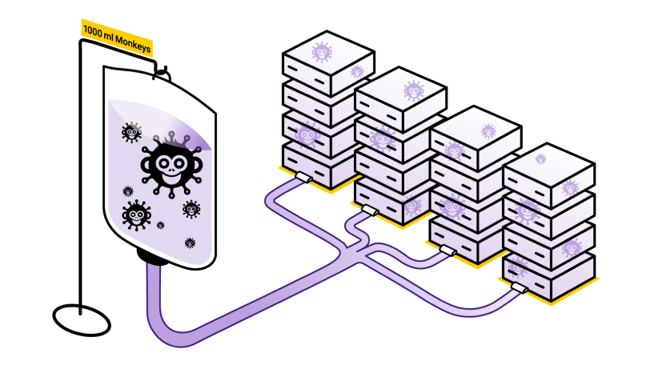

# Infection Monkey

Welcome to Infection Monkey!  We're glad you could swing by.🐒 Here's all the
info you'll need to start monkeying around.

## What is Infection Monkey?
Infection Monkey is an open-source adversary emulation platform that helps you
improve your security posture using empirical data. Monkey uses various methods
to self-propagate across a network and reports its activities to a centralized
command and control server known as the Monkey Island. 🐵🏝️ You know, like
malware, but ✨safe.✨

## What's in it?

Infection Monkey is comprised of two components:

* **Agent** - A configurable network worm that can infect machines, steal
  data, and deliver payloads.
* **Monkey Island** - A command and control server used to control and
  visualize the Infection Monkey's progress throughout the simulation.

### Build up your malware antibodies 💉

You can think of Infection Monkey as a kind of "malware vaccine." Prior to the
invention of mRNA vaccines, biological vaccines worked as follows:

1. Collect a sample of the virus.
2. Through the magic of chemistry, create a weakened or inert form of the
   virus.
3. Inject the weakened virus into the human body, allowing the immune system to
   built up a defense.

Once the immune system has built up a defense, it can recognize and fight off
the real pathogen if it should ever infect the body.

**Infection Monkey aims to use this same approach to combat computer viruses
(or other types of malware.)**

1. Collect a sample of the malware.
2. Analyze the malware and understand its behaviors.
3. Modify Infection Monkey's configuration to enable behaviors that closely
   mimic those of the malware, but without causing damage to the target
   systems.
4. Inject the Monkey Agent into the network and validate (empirically) that
   your security controls can detect, prevent, or otherwise mitigate the
   infection.
5. If the infection is not successfully thwarted, take the necessary steps to
   "build up your immune response" by improving your security tools, policies,
   and processes.

Sun Tzu said, "if you know others and know yourself, you will not be imperiled
in a hundred battles." Knowledge of both your adversary's tactics and your own
defensive capabilities is necessary in order to successfully secure a network.
Infection Monkey aims helps you to know both.

Be the chimpion of your network. Learn more about the Monkey at
[akamai.com/infectionmonkey](https://www.akamai.com/infectionmonkey)

## Screenshots

### Map

### Security report

## Main Features

The Infection Monkey uses the following techniques and exploits to propagate to
other machines.

* Multiple propagation techniques:
  * Predefined passwords
  * Common logical exploits
  * Password stealing using Mimikatz
* Multiple exploit methods:
  * Log4Shell
  * RDP
  * SSH
  * SMB
  * WMI
  * and more, see our [documentation
    hub](https://techdocs.akamai.com/infection-monkey/docs/exploiters/) for
    more information.

## Setup
Check out the
[Setup](https://techdocs.akamai.com/infection-monkey/docs/setting-up-infection-monkey/)
page and the [Getting
Started](https://techdocs.akamai.com/infection-monkey/docs/getting-started/)
guide in our documentation.

The Infection Monkey supports a variety of platforms, documented [in our
documentation
hub](https://techdocs.akamai.com/infection-monkey/docs/operating-systems/).

## Building the Monkey from the source
To deploy the development version of Monkey you should refer to readme in the
[deployment scripts](deployment_scripts) folder or follow the documentation in
the [documentation
hub](https://techdocs.akamai.com/infection-monkey/docs/development-setup/).

### Build status
| Branch | Status |
| ------ | :----: |
| Develop |  |
| Master |  |

## Tests

### Unit Tests

In order to run all of the Unit Tests, run the command `pytest` in the `monkey`
directory.

To get a coverage report, first make sure the `pytest-cov` package is installed
using `pip install pytest-cov`. Run the command `pytest --cov-report=html --cov
.` in the `monkey/` directory. The coverage report can be found in
`htmlcov/index.html`.

### Blackbox tests

In order to run the Blackbox tests, refer to
`envs/monkey_zoo/blackbox/README.md`.

# License

Copyright (c) Guardicore Ltd

See the [LICENSE](LICENSE) file for license rights and limitations (GPLv3).
